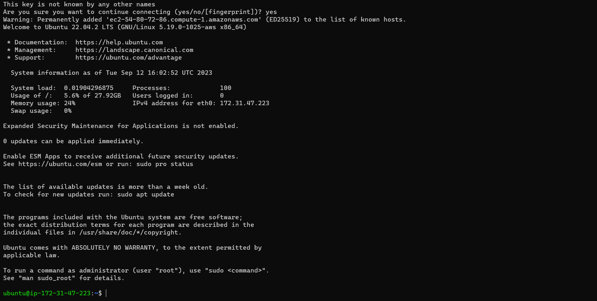
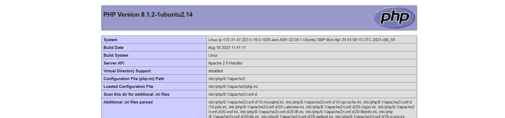

***To start Lamp Stack implimentation Project, i followed the process bellow***

-  I already have an AWS account . So i will need to create a Linux instace for my web server 

- After creating Linux Instance( **UBUNTU**), I named it **Myserver** and saved the **pem** key in my system home directory **C:\Users\Henry>**

- Using SSH , I connected successfully to my Ubuntu instance 

-  I then updated the ubuntu Linux using **sudo apt update**

-  I used this command **sudo apt install apache2** to install apache web server 

- For me to see that apache is corectly installed via web browser, I then added inbound rule to allow **Http** in my instance 

- Using this command **sudo apt install mysql-server**, i installed MYSQL server

- with this command, **ALTER USER 'root'@'localhost' IDENTIFIED WITH mysql_native_password BY 'PassWord.1';**, i added password to **mysql** 

- To install  PhP, and its dependancies , I used this code.  **$ sudo apt install php libapache2-mod-php php-mysql**

- To eneable php on the website , I edited the following codes , **DirectoryIndex index.html index.cgi index.pl index.php index.xhtml index.htm**
 to this one         **DirectoryIndex index.php index.html index.cgi index.pl index.xhtml index.htm**  using this command **sudo vim /etc/apache2/mods-enabled/dir.conf**  and saved with **:wq** command and reloaded the apache

 - 

- I then created **index.php** in my root folder to test that PHP is coreectly working using super user account account with **sudo -i**

- I edited index.php using nano command and added the Php code , Rebooted apache to take effect 

using my public ip address http://54.80.72.86/ 

