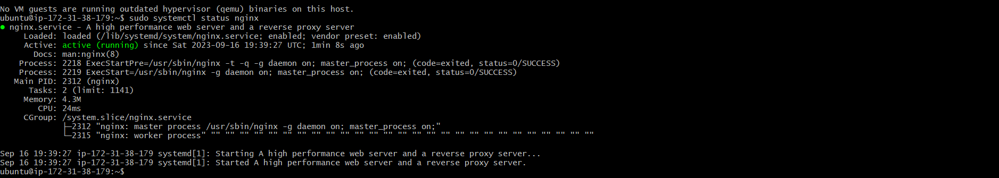
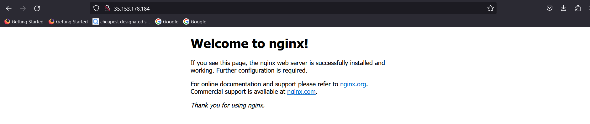
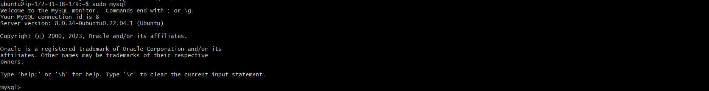
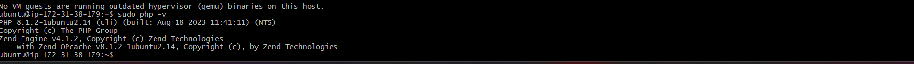
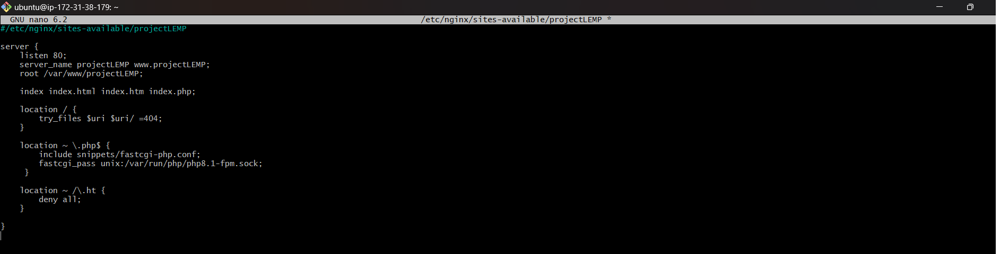
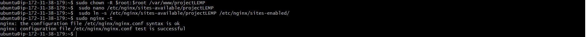
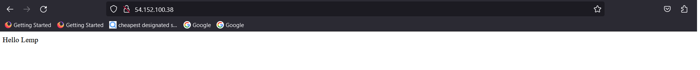

  Lemp Stack Implementation Project

-------------------------------------------------------------

  STEP 1

- After connecting to my ubuntu instance via git bash, I updated my instance. 

- I installed **Nginx** using command (***Sudo apt install Nginx***)

After Nginx Installation, I checked to see if it was installed successfully using ***sudo systemctl status nginx*** . Its now in green and running 

- To recieve traffic from our webserver (Nginx), I opened porth 80 (http) in my instance. With this, I will be able to access it via locally and via web browser. 

- To check local access , I used this command ***(curl http://localhost:80)***
 and it was successful 

-  To check access via web browser , I entered my AWS ubuntu instance public ip address on my browser, and it worked perfectly. 

  STEP 2

-  Installing **Mysql** : using ***Sudo apt install mysql-server -y***

- After installation of Mysql, I logged in successfully using  ***sudo mysql*** command

- Now, while still in my database (mysql-server,) i changed root authentication methord to use mysql native password by entering this command ALTER USER **'root'@'localhost' IDENTIFIED WITH mysql_native_password BY 'PassWord.1';** to use PassWord.1 as my password . Then, Exited **mysql**

-  - For more security of my database, I run interactive script with this code:  **sudo mysql_secure_installation**

- 

  STEP 3

- Installing **PHP**
 using **sudo  apt install php** -y was successfully installed 

 -
 - I also installed Php components using  **sudo apt install php-fpm php-mysql**

  STEP 4

-  **Installing nginx to use php processor.**

- I created a folder in my root folder called projectLEMP using  **sudo mkdir /var/www/projectLEMP**

-  I assigned ownership to the **projectLEMP folder** using 

- with this command  **sudo nano /etc/nginx/sites-available/projectLEMP** i created a configuration file and edited with **Nano** command

-  To activate my configuration, i used **sudo ln -s /etc/nginx/sites-available/projectLEMP /etc/nginx/sites-enabled/**
and checking for syntax error was result was ok

-  I also unlink the default nginx configuration host to allow my own to take effect by using **sudo unlink /etc/nginx/sites-enabled/default** and then rebooted nginx for changes to take effect.  **sudo systemctl reload nginx**

-  Because my newfolder (webpage) is still empty, i created html index file in it called **index.php** using **touch command** 

-  With nano command, I edited index.html file and added a write up (Hello lemp) and saved. rebooted **nginx** 

- with my public ip sddress, http://54.152.100.38/ entered in my browser. I saw **Hello lemp** . which means my LEMP stack is fully configured and working. 

  STEP 5

-  **TESTING PHP WITH NGINX**

- i craeted a PHP file in my root folder called **info.php** using **touch** command and edited with **nano** command and pasted a valid php code inside for text. and saved using CTL+O and CTL+X to exit.

-  

