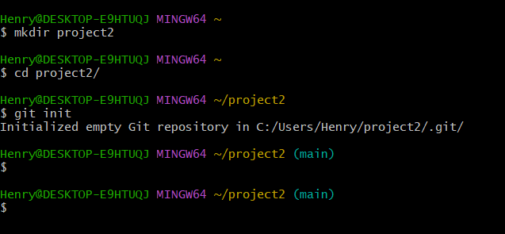
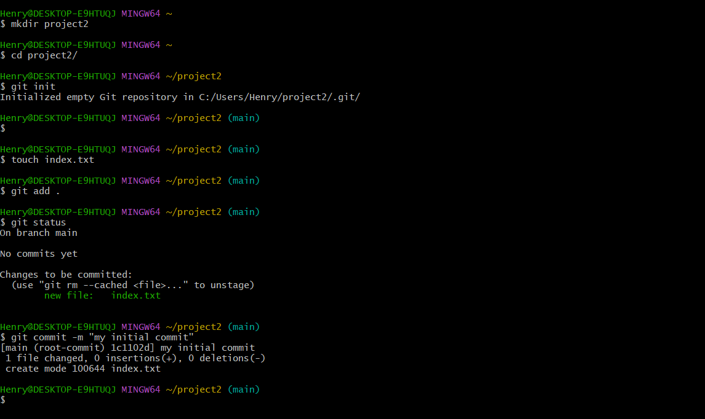
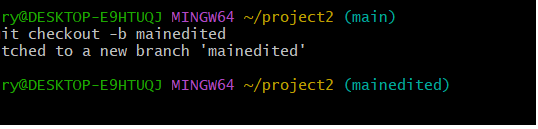
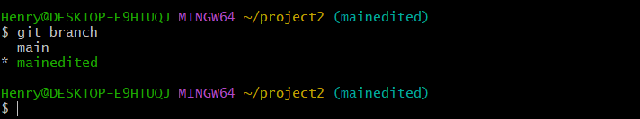
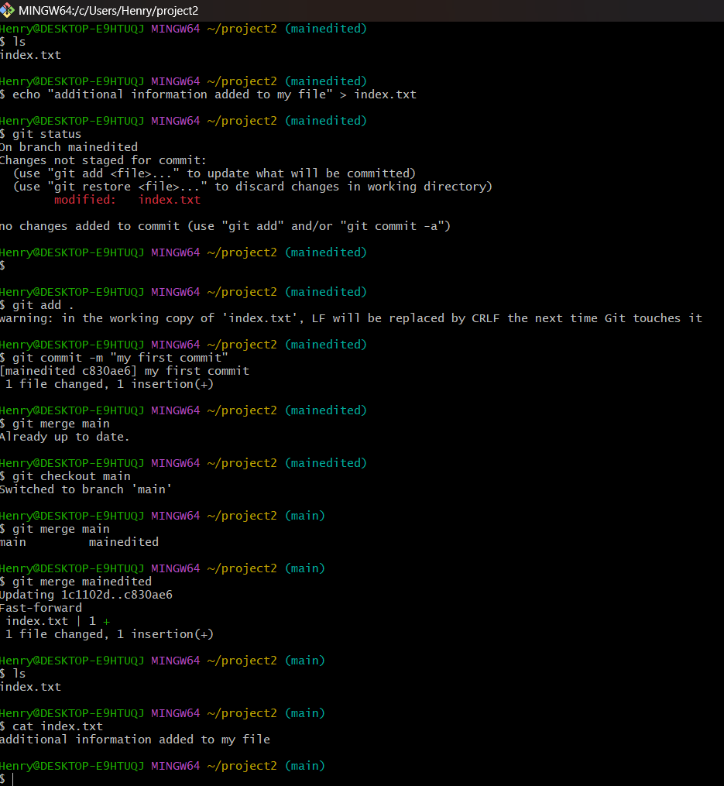

# Git project <!DOCTYPE html>
<html>
<head>
    
</head>
<body>
    
  

</body>
</html>

1. I made a new directory called **Project2** using **mkdir** Command

2. I then switch my working directory to **Project2** i just created

3. I initialized it using the **Init** command . Check bellow image

4. Inside my new directory **Project2**, I created a filed called **index.txt**.

In GUI, i  then wrote this text "my commit" in **index.txt** file 

With **Git add .** command, I added my file **index.txt** file to be tracked.  and them commited using commit command **commit  -m** "(message)"

5. I made a new branch called **mainedited** using **git checkout -b**

and it swiched authomatically to the new branch 

6. I listed the all the branched using **git branch** command

7. I edited the content of this file called  **index.txt** so i can merge it to the **main** branch 

  **add .** to track the file 
 **commit -m** (to comit)

 **git checkout main** to switch to main branch

 **git merge** (mainedited) to merge 

8.  **git branch -d** deleted this branch **mainedited**

