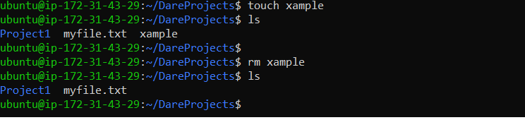
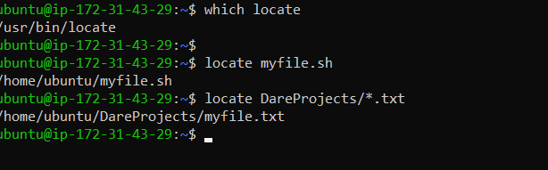
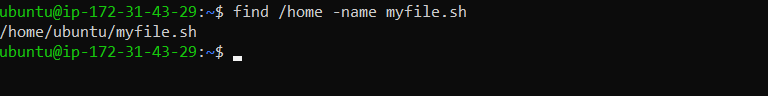
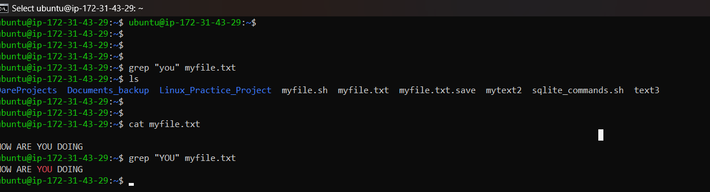
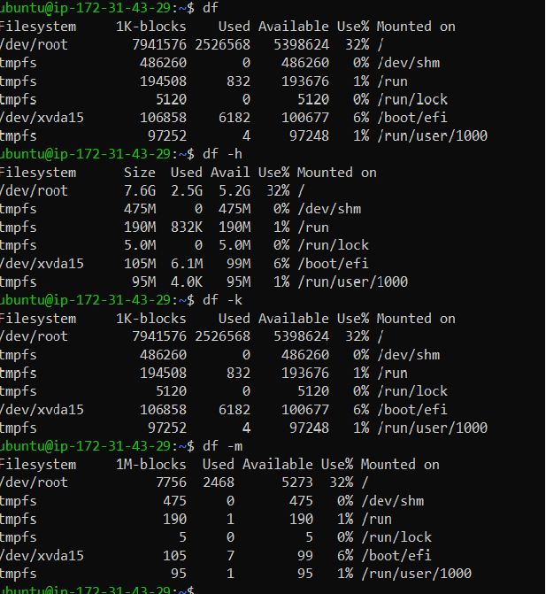
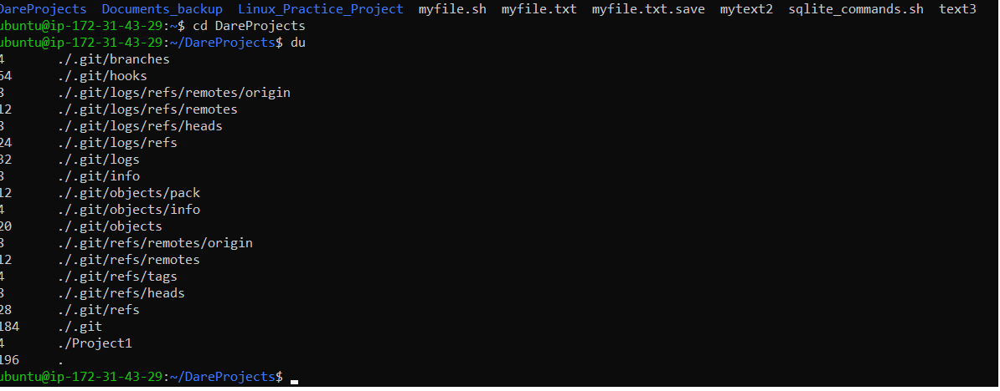
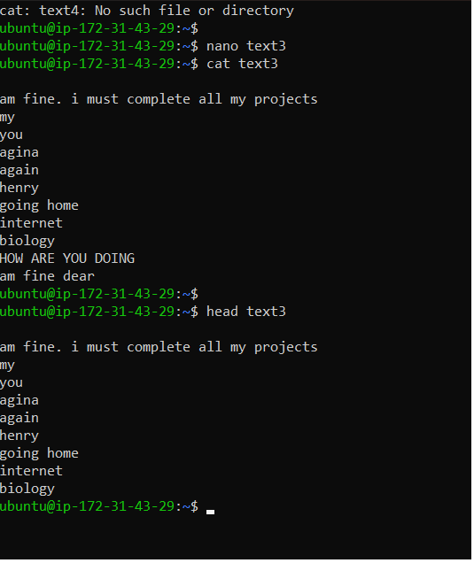

Linux Practice Project

Using this command  
 1.    "**sudo apt upgrade**" 

2. **pwd**

This command shows my present working directory 

3. **cd** 

I use this command to switch to another working directory 

"cd" ..   returns me to previous directory 

"cd -"     takes me back to Project1 directory 

"cd"  returns me to home directory 

4. **ls**

This command displays my folders as shown on the picture bellow 

5.  **cat**

I Use this command to read the content of my file . I have 3 files named myfile, text2 and text3. 
file text3 is empty , I moved the contents in myfile and text2 to text3 using  "cat myfile.txt text2>text3"

6. **cp**

I use this command to relocate (myfile) to (Dareyproject)folder and using cp -R to backup 

7. **mv**

I use this command to rename my file as **text2** to **mytext2**

8. **mkdir**

I use this command to make a new directory in dareyproject directory call **mymovie**

9. **rmdir**
I use this command to remove a directory i created before in DareyProject folder **mymovie**

10. **rm**

I use this command to delete a file in any folder. The picture bellow show how i deleted a file in DareyProject folder called **Xample**

11. **touch**

I use this command to create a file in any directory 

12. **locate**

I use this command to seach for a file named **myfile.sh** in **DareyProject** folder and to search for a file with any extension in same directory

13.  find [option] [path] [expression]

 I use this command to find **fyfile.sh** within my home directory 

14. **grep**

I use this command to search for a word "YOU" in **myfile.txt** 

15 **df** (**df -m** )(**df -h**)(**df -k**)

This commands check my disk usage 

16. **du**

This command shows me how much space my directory **DareyProject** and all the files inside takes 

17. **head** 

I use this comand the display the first 10 lines content in my file named text3.txt

